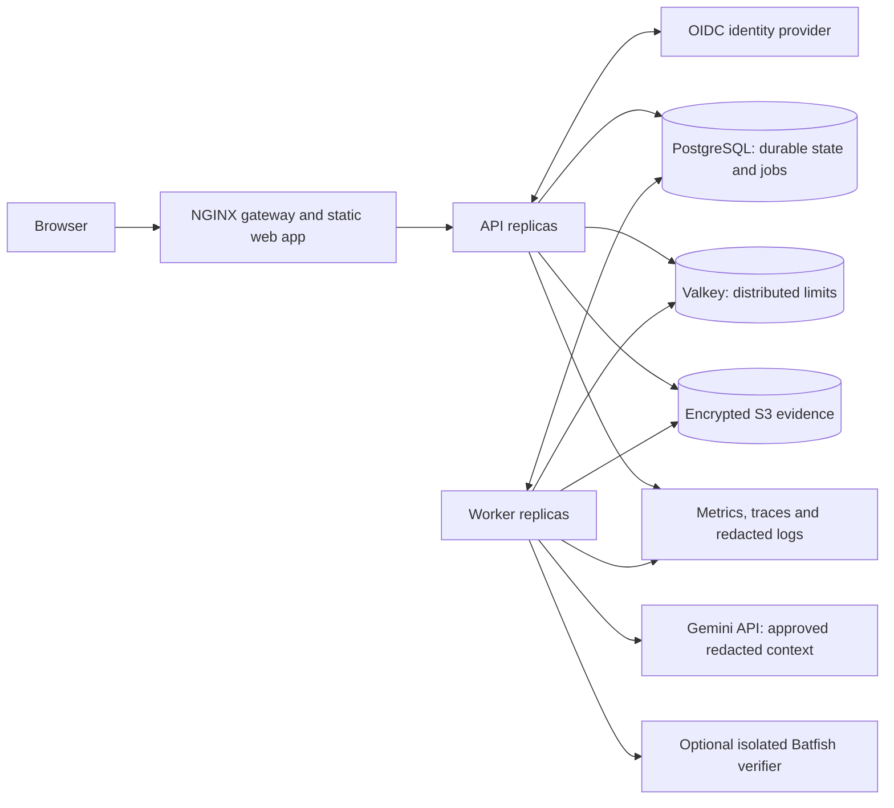

# SIH26155 implementation plan

Status: **APPROVED — IMPLEMENTATION IN PROGRESS**
Prepared: 28 September 2026  
Revision: **2 — local Docker application, Gemini, source-backed benchmark corpus**  
Project root: this `SIH26155` directory.

Application: **AI-Driven Multi-Vendor Network Security Compliance Auditor**, National Technical Research Organisation (NTRO), Software. [Official statement](https://www.sih.gov.in/sih2026PS); the selected statement and its capture metadata are preserved in [docs/problem-statement.json](docs/problem-statement.json).

Production-ready here means a complete, secure, maintainable application that runs locally in Docker, persists real data, handles failure and overload, and has verified workflows. **Cloud deployment, cloud accounts, domains, managed services, Kubernetes and cloud infrastructure spending are outside the current build.** Gemini is the external inference API; using it does not require deploying this application to a cloud service.

The user approved revision 2 on 28 September 2026. Implementation and local verification are authorized. The earlier one-day constraint remains removed. The user supplies both the Gemini API key and model identifier through `.env`; no model is selected automatically.

This revision incorporates the [user-provided full statement](docs/problem-statement-user-provided.txt) and the organizer's reference line. The user confirmed that the data-links field names authorities and standards; **there is no supplied downloadable dataset**. The [data and benchmark plan](docs/dataset-and-benchmarks.md) defines how to assemble and validate our own corpus from those references.

## 1. Outcome and technical contribution

Deliver a working, authenticated, multi-tenant application that ingests configurations, explains supported compliance findings, learns unfamiliar formats through a reviewed interface, validates learned mappings, and generates device-specific reports and remediation proposals.

The distinguishing contribution is **validated adaptation to unfamiliar configuration semantics**. An agent identifies consequential uncertainty, selects targeted questions, proposes a mapping, runs checks, and records evidence. Reviewed deterministic rules produce the compliance verdict. A model response alone cannot establish compliance or promote a learned mapping.

Measure the contribution against fixed parsers, a direct LLM with the same documentation, and established tools on overlapping tasks. Novelty and superiority remain hypotheses until those comparisons are run. See [the novelty audit](docs/novelty-audit.md).

## 2. Recommended stack and service boundaries

| Component | Choice | Purpose |
| --- | --- | --- |
| Web application | React, TypeScript, Vite, React Router, TanStack Query, Tailwind | Responsive audit workspace with typed API access and accessible interactions |
| API service | Python 3.12, FastAPI, Pydantic, SQLAlchemy, Alembic | Authentication, authorization, ingestion, workflow endpoints, reports and administration |
| Audit-worker service | Same Python domain package, separate process/container | Normalization, bounded agent workflows, mapping validation, compliance evaluation and PDF generation |
| System of record | PostgreSQL 17 | Tenant data, versioned rules/mappings, audit evidence metadata, sessions and durable job state |
| Distributed limits | Redis-compatible Valkey | Atomic shared rate limits, short-lived counters and provider concurrency permits |
| Evidence storage | Local S3-compatible MinIO container and persistent volumes | Application-encrypted configuration snapshots, reports and evidence; no cloud bucket required |
| Authentication | OIDC using Authlib and a local Keycloak container | Authorization Code flow with PKCE and server-managed sessions; no external identity account required |
| Hosted AI | Official Google GenAI Python SDK (`google-genai`), Gemini Developer API | Controlled function calls and structured proposals; `GEMINI_API_KEY` and `GEMINI_MODEL` supplied by the user |
| Reverse proxy | NGINX gateway, also serving the compiled frontend | TLS, routing, request/body limits, security headers and upstream load distribution |
| PDF generation | ReportLab in workers | Asynchronous device reports without browser execution or remote asset fetching |
| Runtime packaging | Docker Compose with an optional local scale-test overlay | Reproducible local startup, independent API/worker replicas and persistent services |
| Operations | OpenTelemetry, Prometheus/Grafana profile, structured logs | Service latency, job age, errors, queue depth, rate limits and provider usage |

Use supported patch releases, lock dependency versions, verify image maintenance/licensing, and pin release image digests during implementation. Node 24 LTS is the frontend build target. No additional workflow framework, vector database, message broker or service mesh is needed for the initial architecture.

The API, worker and gateway are independently deployable services. Keep normalization, compliance and reporting as modules within the worker until measurements justify splitting them. Jobs live in PostgreSQL so Redis loss cannot discard accepted audits.

## 3. Product scope and user journeys

| Journey | Working behavior required |
| --- | --- |
| Sign in and organization access | OIDC sign-in, organization membership, explicit roles, session revocation and tenant isolation |
| Upload and inventory | Single/bulk configuration uploads; format/size validation; vendor/OS/device identity with source evidence; unknown identity stays unknown |
| Run an audit | Choose an applicable policy pack; receive a durable job ID; see progress, partial results, cancellation and actionable failure states |
| Investigate a finding | Severity, affected setting, exact source location, policy version, rationale, coverage limitations and remediation proposal |
| Train a new format | Raw-line/context viewer, suggested mapping, administrator correction, test cases, reviewer decision and version history |
| Resolve uncertainty | Prioritized questions with reasons; pause/resume the audit without holding a running worker |
| Review changes | Proposed command sequence/diff, prerequisites, checked properties, unresolved risks and supported rollback guidance |
| Export evidence | One PDF per device plus JSON/CSV exports; downloads are authorized, expiring and linked to immutable audit versions |
| Operate the service | Queue/job state, usage limits, policy/mapping versions, retention settings, membership and audit trail |
| Maintain evidence sources | Register standard/vendor-document versions, import authorized reference material, inspect provenance and review derived rules |

The interface will provide keyboard navigation, readable severity/coverage indicators, accessible dialogs, large-table pagination, empty states, retries and honest progress states. Main views: Overview, Devices, Audits, Finding Detail, Training Queue, Mapping Review, Policy Library, Reports and Administration. A source viewer and evidence panel are central to the experience. Setup must explain missing Gemini configuration, unsupported model capabilities and unavailable local dependencies without presenting a fake successful audit.

### Initial declared coverage

- First validation cohort: Cisco IOS/IOS-XE, Junos and FortiOS, subject to obtaining suitable lawful examples. They exercise command-oriented, hierarchical and scoped configuration semantics. Expand the tested cohort using documented evidence rather than a fixed vendor allowlist.
- The input and mapping system must accept additional text/JSON/XML formats. Include a held-out family or firmware branch in adaptation evaluation, and at least one structured configuration family such as SONiC or cloud security-group exports when adequate references exist. Unknown formats enter the learning workflow without a backend deployment; successful upload alone is not verified vendor support.
- Target at least 20 applicable technical control definitions spanning administrative access, SSH/Telnet/HTTP, authentication, session timeouts, logging, NTP, SNMP, management ACLs and relevant cryptographic settings. Applicability depends on device family and version.
- Versioned policy packs and crosswalks for CIS, NIST SP 800-53, DISA STIG and ISO/IEC 27001. Ship only reference material/rules we can legitimately use and verify. Public technical checks and explicit crosswalks are the initial content; licensed benchmark imports are supported when provided.
- Clearly distinguish implemented technical checks, unmapped controls and organizational controls. A selected pack does not imply complete benchmark coverage or organization-wide certification.
- Verdicts: pass, fail, insufficient evidence, unsupported and not applicable. Coverage is visible beside any score; unsupported controls cannot inflate compliance percentages.
- Generate changes for review. Automatic application of commands to live network equipment is outside this approved scope. File ingestion satisfies the official brief without requiring device credentials.

### Traceability to the supplied statement

| Official requirement | Implementation and acceptance evidence |
| --- | --- |
| Single/bulk ingestion across heterogeneous devices | Persist source snapshots and per-file status; mixed vendors and unsupported input must coexist in one batch |
| Vendor-neutral Security Baseline Model | Typed facts with evidence, hierarchy, inheritance, explicit/default/unknown state, firmware scope and mapping version |
| Administrator trains an unseen format | GUI displays unrecognized source context; administrator corrects the mapping; regression tests and review activate it as versioned data |
| Learning without backend code redeployment | Activate an approved mapping while API and workers remain running; a fresh audit uses the new mapping and rollback restores the prior behavior |
| Multiple selected frameworks | Versioned rules plus explicit CIS/NIST/STIG/ISO crosswalks; source text and implementation coverage remain visible |
| Device identification | Model, serial number and OS version only when supported by evidence; missing fields are labelled unavailable |
| Clear findings and remediation | Supported pass/fail findings, severity, exact evidence, device/version-specific commands, prerequisites and verification status |
| One comprehensive PDF per device | Identification, selected policies, coverage, findings, evidence references, commands and audit versions in the same report |
| Vendor/standard/version scalability | Extend approved declarative mappings and policy content through the application, within the supported selector/transform vocabulary |

Netmiko/NAPALM are suggestions in the brief, not dependencies required for uploaded-file auditing. Direct device collection can be added if requested later; the present application needs no live device credentials.

## 4. Domain model and correctness boundaries

Store organizations, memberships, devices, immutable configuration snapshots, reference-source versions, dataset manifests, policy/rule versions, mapping versions, audits, normalized facts, findings, clarification tasks, mapping test cases, remediation proposals, report artifacts, jobs, usage records and audit events.

Every tenant-owned record carries an organization identifier. Enforce authorization in the service and PostgreSQL row-level policies under non-owner application roles. Use transaction-local tenant context; connection reuse must not leak tenant state. Administrative job claiming uses a separately scoped role; job payloads derive tenant context from stored records, never from an untrusted request header.

Each normalized fact records value/type, evidence location, scope, explicit versus inherited/default status, device/firmware applicability and the mapping version. Preserve absent, disabled and unknown as different states. Each audit pins its input, policy, mapping, prompt and model versions so later edits do not silently rewrite history.

Snapshot identity and deduplication are tenant-scoped. Unchanged input may reuse validated work only when every relevant parser/mapping/policy version matches. Semantic caches must never mix tenants.

## 5. Agent and adaptation workflow

1. Validate and fingerprint a snapshot; preserve the original in encrypted storage.
2. Apply supported normalization and existing approved mappings. Report unsupported syntax and consequential ambiguities.
3. Retrieve relevant passages from an administrator-approved, versioned documentation collection. Start with PostgreSQL full-text search; add embeddings only if retrieval evaluation demonstrates a need.
4. Use a bounded agent loop to inspect context, retrieve evidence, propose facts/mappings and request clarification. Rank questions by potential control impact and uncertainty reduction; compare that ranking with simpler strategies.
5. Represent proposed mappings in a constrained declarative schema. Permit specified selectors, scope rules and typed transformations; never execute generated Python, shell commands or arbitrary expressions. Bound text matching, parsing time and memory.
6. Run positive, negative, inheritance, negation, nesting and relevant version/regression cases. Agent-generated cases supplement independently labelled examples; they are not their own correctness oracle.
7. An authorized reviewer approves or rejects a mapping. Keep its applicable families/versions explicit. Activating an approved mapping is a data change that requires no backend redeployment; rollback restores a prior version.
8. Resume the audit and evaluate reviewed rules deterministically. Findings link to the exact evidence and control version.
9. Propose minimum necessary remediation. Validate the affected controls and supported operational invariants before marking a proposal as checked.

Persist useful evidence, validated tool inputs/results, structured decisions and workflow transitions. Treat provider continuation metadata as opaque protocol state, protected separately from user-facing audit evidence; never turn model reasoning into compliance justification. Apply input/output limits, maximum tool steps, deadlines and per-tenant/provider budgets. Tool schemas use strict application validation, but schema conformity does not prove semantic correctness. Handle safety blocks, incomplete responses, invalid arguments, unsupported features and provider errors explicitly.

### Gemini integration contract

- Use the native Google GenAI SDK and Gemini Developer API with an explicitly supplied `GEMINI_API_KEY`. Do not add an OpenAI compatibility layer, Vertex AI, Google Cloud service accounts or a cloud project deployment.
- Read `GEMINI_MODEL` exactly as configured. Keep its template value empty. Changing it requires configuration reload/service restart, not source edits. Never silently replace an inaccessible or incompatible model.
- When `LLM_ENABLED=true`, missing credentials/model configuration must produce an actionable configuration error. With AI disabled, supported deterministic audits and stored reports remain usable; AI-dependent steps clearly indicate that configuration is required.
- Follow Google's [function-calling](https://ai.google.dev/gemini-api/docs/function-calling?hl=en) and [structured-output](https://ai.google.dev/gemini-api/docs/structured-output) guidance. Use an application-controlled tool dispatcher with allowlisted functions, Pydantic argument/output validation, explicit call identifiers and per-job limits. The model proposes a call; the worker authorizes and executes it.
- Verify the chosen model supports the required function-calling and structured-output flows. Use separate investigation and structured-extraction calls when appropriate; do not assume every model supports combining all features in one request.
- Keep durable business state in PostgreSQL. Use stateless provider calls where supported (`store=False` on the documented Interactions path), preserving required opaque continuation state exactly for the active exchange. Do not reconstruct or discard protocol-required response parts. A stateless setting is not a claim of zero provider retention; account terms/settings still apply.
- Classify authentication, invalid-model, quota, safety, schema and transient errors. Retry only transient failures within the budget; honor backoff and applicable retry guidance. Record model, provider usage, latency, call attempts and prompt/schema versions without secrets or raw configurations.
- Keep request-rate, concurrency, token, timeout and maximum-step limits configurable. Provider quotas may be shared at project/model level; coordinate all local workers through the shared limiter and react to provider throttling rather than assuming a specific paid/free-tier quota.

No model-specific accuracy, latency or cost claim is built into the compliance engine. Live verification will use the user's selected model after approval and key configuration.

Configuration files and documentation are untrusted data. The agent has no unrestricted browser, arbitrary outbound URL tool, command shell or live-device write tool. Before Gemini calls, redact credentials and send only necessary context; preserve structural semantics and declare when redaction prevents a conclusion. Raw configurations must not enter provider calls, telemetry or exception logs by default. Provider retention/data-processing settings must be checked for the account being used.

Batfish is an optional Docker verification integration for supported snapshot formats and properties. Reuse its established analysis capabilities. Producing a vendor-neutral schema does not add new-vendor support to Batfish; unsupported properties remain unverified. The auditor must remain usable if this optional verifier is unavailable.

## 6. API and durable processing

Use versioned REST endpoints for uploads/devices, audits/jobs, findings, clarification answers, mappings/tests/reviews, policy packs, reports, memberships and system health. Publish OpenAPI and generate frontend types. Prefer bounded polling for job progress; add streamed updates only if it improves a measured UX need.

Long operations return `202 Accepted` with a job identifier after durable recording. Audits reference validated, committed storage objects. Stage uploads and reconcile abandoned objects so an object-store/database partial failure does not leave a runnable job with missing input.

PostgreSQL workers claim eligible jobs with row locking and `SKIP LOCKED`, leases, heartbeats and fencing tokens. Jobs include tenant, stage, attempt, availability time, lease expiry and input versions. Complete a stage and enqueue its successor transactionally. Late workers cannot publish over a reclaimed lease.

Processing is at least once with idempotent durable effects, not an exactly-once claim. Enforce tenant-scoped idempotency keys on create-audit requests; atomically publish results and artifact references. A crash around an external AI call can repeat provider usage; record attempts and bound that exposure.

Retry transient failures with bounded exponential backoff and jitter, respect provider retry guidance, and move exhausted jobs to a visible failed/dead-letter state. Permanent validation failures do not retry indefinitely. Cancellation is checked between stages; clarification pauses release leases. Separate concurrency pools prevent slow AI calls or PDFs from starving deterministic audits. Apply tenant concurrency caps and fair scheduling under sustained backlog.

## 7. Rate limits, overload and proxy configuration

| Boundary | Initial configurable policy |
| --- | --- |
| Authentication entry points | 10 attempts/minute/IP, combined with identity-provider protections |
| Authenticated reads | 120 requests/minute/user, burst 30 |
| Mutations | 30 requests/minute/user, burst 10 |
| Bulk upload | 5 batches/minute/tenant; at most 100 files, 10 MiB/file and 100 MiB/batch |
| Audit creation | 20 requests/minute/tenant; cap jobs per batch and total queued work independently |
| AI execution | Initially 1 concurrent call/tenant, 2 globally, and 5 requests/minute globally; configurable token and tool-step budgets |
| Reports | 5 new report generations/minute/user; reuse identical completed artifacts |

These are defaults to tune with measured capacity. NGINX handles coarse IP/body/time limits. Atomic Valkey operations enforce shared user/tenant/provider limits across all replicas. Correct `429` responses carry `Retry-After`; admission caps also bound outstanding jobs, stored bytes and concurrency. Apply checks before expensive reads, uploads or model calls.

Trust forwarded addresses only from the configured proxy chain. Internal services, storage, databases and metrics endpoints are not publicly exposed. Cap upstream timeouts; API requests do not wait for an audit to finish. Validate Host/origin values and restrict cross-origin access.

If Valkey is unavailable, fail closed for new expensive work and provider calls with a retriable unavailable response. Existing evidence browsing can use a restrictive per-instance fallback. Do not silently bypass distributed budgets. PostgreSQL remains the source of accepted jobs.

## 8. Security and data protection

- Use OIDC Authorization Code with PKCE, server-side sessions, HttpOnly/SameSite cookies, CSRF protection, session expiry/revocation and role-based authorization. Support Secure cookies with the local TLS profile. Any HTTP exception is explicit and restricted to loopback/local development. Roles: viewer, auditor, reviewer and tenant administrator; raw-configuration access is explicit.
- Encrypt sensitive artifacts and tokens at rest, use tenant-scoped object keys and short-lived downloads, and keep encryption keys separate from the stored data. Local bootstrap generates unique secrets in `.env` or mounted secret files. Use authenticated application encryption for sensitive object contents so local operation does not require cloud KMS; document key backup, versioning and rotation.
- Reject path traversal, oversized inputs, unsafe XML entities and malformed content. Ordinary bulk configuration upload means multiple files. A separate administrator-only reference-dataset import may handle ZIP packages with bounded extraction and explicit checks; no arbitrary archive execution. Bound parser and PDF work. Escape configuration text in the UI and exports.
- Restrict workload egress to required services and approved AI endpoints. Documentation URLs cannot become arbitrary server-side fetches; importing documentation is an authenticated, controlled operation.
- Record immutable application audit events for access-sensitive actions, membership changes, mapping/policy approvals, exports and deletion. Database permissions prevent ordinary application edits to history. Do not describe this as tamper-proof against database administrators; support independent export for stronger retention.
- Default raw-artifact retention is 30 days, configurable by the tenant administrator; record/report retention is explicit. Deletion includes objects, derived exports, caches and applicable provider-side artifacts. Backup retention and deletion replay on restore must be documented.
- Secrets stay out of Git, image layers, frontend bundles, model context and logs. Supply-chain checks include dependency/image scans, secret scanning and an SBOM. Release blockers require actual remediation or a documented, justified disposition.

## 9. Local Docker runtime and scale readiness

Compose will bring up gateway, API, workers, PostgreSQL, Valkey, object storage and local OIDC. Optional profiles add observability and Batfish. Use multi-stage builds, unprivileged users where supported, read-only application filesystems, dropped capabilities, resource limits, persistent data volumes and startup/readiness checks. Bind the gateway to loopback by default; administrative ports require an explicit local-only profile.

Required local behavior:

- A documented bootstrap validates prerequisites, generates missing local service secrets, configures the local identity realm/bucket and applies migrations. It does not overwrite user-supplied Gemini settings or existing credentials.
- The browser and API must agree on the OIDC issuer. Explicitly configure local gateway URLs and internal token/JWKS back-channel endpoints; test redirects and issuer validation from both the browser and containers.
- Normal mode runs one API and worker. A scale-test overlay runs at least two of each, with no fixed host ports/container names that prevent replication. NGINX must resolve/load-distribute across actual healthy API replicas and cope with replacement containers; verify this experimentally.
- Startup/readiness/liveness checks have separate meanings. Health checks expose dependency state; restart policies handle exited processes. Do not assume Docker Compose automatically restarts an unhealthy process merely because a health check failed.
- Graceful shutdown stops new claims, drains bounded work and releases/reclaims leases. Queue admission limits, database pool limits and Gemini budgets remain effective as replicas change.
- Database, object store and identity configuration persist across container recreation. Provide backup, restore, key recovery and migration commands with a rehearsal against a clean set of volumes; shutdown must not delete data by default.
- A local TLS profile and secret-file configuration exercise secure deployment settings without buying a domain or obtaining cloud credentials. Use separate internal application/data networks; do not mount the Docker control socket.
- Run schema migrations once as a controlled job. A failed migration blocks application startup/upgrade; backward-compatible changes and rollback instructions are documented.

Host failure still stops a single-host stack. True host/zone redundancy would need external infrastructure later. Keep images, health endpoints, stateless API behavior, durable jobs and runtime settings portable, and document a short future-deployment checklist. **Do not implement Kubernetes/KEDA, provision cloud resources or make cloud failover a current completion gate.**

## 10. Reliability objectives and failure behavior

Targets below are acceptance objectives to measure, not claims of achieved performance or a guaranteed SLA.

| Objective | Initial target / evidence |
| --- | --- |
| Local stability | One-hour bounded soak test with no lost accepted work or unrecovered service failure; report resource growth, rejected work and observed errors |
| Normal metadata reads | Target 50 aggregate requests/second, p95 below 500 ms and p99 below 1 s, with a realistic multi-tenant mix and below 1% server errors |
| Deterministic audit throughput | Target at least 50 configs/minute for supported inputs up to 250 KiB and the declared control set; report PDF and Gemini latency separately |
| Worker failure | No lost accepted jobs; eligible work reclaimed within 90 seconds of abrupt termination; no duplicate published audit/report |
| Provider outage | Completed reports and deterministic evaluation remain accessible; AI-dependent stages become waiting/retry/failed with honest status |
| Local restore | Restore a small reference backup into clean volumes within a target 15 minutes; verify configuration/report hashes, identity records, rule versions and decryption. Recovery point is the last successful consistent backup |

Reference local performance budget: 4 logical CPUs and 8 GiB available to Docker, with two API/worker replicas for the scale test and optional heavyweight profiles disabled. Measure actual workstation capacity first and tune concurrency without disguising a smaller test as a passed target. Record hardware, fixture sizes, control counts, OIDC/service overhead and Gemini quota with every result. These are engineering targets, not reported measurements. No monthly uptime percentage or cloud RPO/RTO is claimed for a local laptop.

If a worker dies, a new worker reclaims the lease. If storage fails, input acceptance pauses safely and existing records remain truthful. If PostgreSQL fails, new work is unavailable until recovery; no local pretend-success queue. A failed PDF can be retried without rerunning the audit. A provider timeout cannot change an unknown verdict into a pass.

Dashboards/alerts cover request latency/errors, queue age/depth, oldest lease, failure/retry counts, provider throttling, actual usage, distributed limiter failures, backup freshness and storage/database health. Logs and traces carry request/job identifiers without raw configurations. Include runbooks for each dependency outage, key rotation, backups, restoration and capacity changes.

## 11. Verification and release gates

1. **Domain correctness:** source-backed and clearly labelled synthetic configurations across the initial families; tests for defaults, inheritance, negation, malformed input, missing evidence, applicability and version changes. Record source/label provenance and any unavailable vendor/version examples. Human-reviewed security cases are required before treating coverage as production-verified.
2. **Adaptation evaluation:** hold out whole vendor families or firmware versions; keep related templates together. Compare equal documentation/annotation budgets. Report false compliant/false failure rates, useful coverage, reviewer effort, cost and regression rates. Include ablations for question selection and test gating. Do not fabricate independent ground truth from the same model under evaluation.
3. **Security:** cross-tenant API and object access, role escalation, session/CSRF checks, malicious upload/parser cases, prompt injection, uncontrolled egress, log/AI redaction and secret scanning.
4. **Workflow:** upload to completed audit/PDF; failed upload reconciliation; unknown-format clarification and approval; mapping rollback; resumed/cancelled jobs; idempotent replay and authorization on downloads.
5. **Resilience:** kill/restart a worker mid-stage, terminate an API replica, interrupt Valkey/storage/provider connections, force lease expiry and exercise queue saturation. Verify recovery and visible failure states.
6. **Capacity:** k6 against at least two API replicas; verify distributed quotas cannot be multiplied by replica count. Benchmark deterministic and AI paths separately and inspect fairness under an overloaded tenant.
7. **Delivery:** lint/type checks, Python tests, frontend/browser tests, image/dependency scans, Compose/scale-overlay validation, migration rehearsal, soak testing and local backup restoration. Use pytest and Playwright for meaningful security/workflow checks, not tests that merely mirror implementation.
8. **Gemini integration:** real tool-call and schema checks using the exact configured model; distinguish invalid credentials/model, throttling, safety blocks and temporary failure. Confirm secrets/raw sensitive input stay out of UI/logs/provider payloads. Offline test doubles may exercise failure paths but cannot establish live-model capability or accuracy.
9. **Honesty gate:** every feature in the UI connects to a real persisted workflow. Public, synthetic and user-provided fixtures are labelled separately. No organizer-dataset claim, simulated uptime, invented benchmark results or silent AI fallback.

A release is ready for its documented coverage and tested local environment. It can be complete without cloud deployment. Document operational limitations and test evidence rather than treating a local build as proof of host redundancy or correctness for every vendor.

## 12. Implementation sequence after approval

| Phase | Deliverable | Exit condition |
| --- | --- | --- |
| 0. Source and corpus foundation | Preserve the supplied statement/reference line; create source register, schema/rule contracts and lawful initial configuration fixtures | Every planned rule/sample has a provenance status; missing labels and versions are visible |
| 1. Foundation | Root project, lockfiles, Dockerfiles/Compose, API/web skeleton, migrations, OIDC, roles and config validation | Real authenticated request through the gateway; two tenants cannot read each other's records |
| 2. Auditing vertical slice | Encrypted upload, durable job, supported normalization, initial versioned rules, findings and PDF | End-to-end audit with exact evidence; worker restart does not lose the job |
| 3. Adaptive agent | Gemini integration using the user-selected model, documentation collection, constrained mappings, clarification/review GUI and regression checks | An unseen-format mapping is tested, reviewed, activated and reused without code deployment |
| 4. Remediation and breadth | Initial vendor/control coverage, all framework crosswalk/import paths, diffs, optional Batfish checks, version histories | Declared coverage is tested and unsupported checks remain explicit |
| 5. Operational hardening | Shared rate limits, fairness/backpressure, retries, retention, telemetry, secret handling and complete UI states | Multi-replica limit and failure-injection checks pass |
| 6. Local production-quality packaging | Compose scale/TLS profiles, CI, SBOM, backup/restore/migration/runbooks and a future-deployment checklist | Local images/proxy replication, data persistence and recovery are verified; no cloud account is needed |
| 7. Evaluation and handover | Reproducible benchmark results, coverage matrix, API/setup/operator docs, architecture document and presentation content | Accurate comparison results, resolved release blockers and a complete reviewable application |

Maintain a requirements-to-check matrix so all official deliverables remain traceable. The official maximum two-page architecture document and five-slide technical presentation will describe the final implementation. A maximum two-minute demo recording depends on the working application; source publication to GitHub/Drive requires a destination/access. These materials follow the software rather than determining its scope.

## 13. Configuration and inputs

The root [.env](.env) is ignored by Git and contains blank secret placeholders. [.env.example](.env.example) documents the same configuration without credentials. Do not paste secrets into chat.

- **Needed from you:** populate `GEMINI_API_KEY` and `GEMINI_MODEL`. Both start empty; you choose the model. Live Gemini checks happen after plan approval; keyless development continues with AI explicitly disabled, never with fake successful audits.
- **Generated by setup after approval:** application encryption/session keys, database/cache/object-store credentials and local Keycloak credentials. You do not need to invent these manually.
- **Local services:** Compose/bootstrap supplies the database, Valkey, object-store and local OIDC endpoints. No domain, cloud bucket, cloud account, Kubernetes cluster or managed-service credential is required for this build.
- **Reference inputs:** the organizer lists `nciipc.gov.in`, `helpdesk1@nciipc.gov.in`, CIS Benchmarks, NIST SP 800-53, DISA STIGs, ISO/IEC 27001 and vendor CLI examples. As clarified by the user, this is a reference list rather than an attached dataset. Build our corpus under [the data and benchmark plan](docs/dataset-and-benchmarks.md), and record the status of each source.
- **Optional additions:** authorized anonymized configurations, expert-reviewed labels and licensed benchmark documents can expand coverage later. Their absence does not prevent the foundational application from being built, but unsupported coverage must stay explicit.

Current workstation check: Git, Node, pnpm, uv and Docker CLI are installed. Docker Desktop's Linux engine was not reachable on 28 September 2026; start it before container-based verification. Container builds will not depend on the host's Microsoft Store Python alias or its non-LTS Node version.

## 14. Approval decision

Approve this revised plan to proceed with the complete local Docker application using Gemini, the declared coverage and the agent review boundaries above. Routine implementation choices and fixes can then proceed without another plan-approval round. Cloud deployment and live network changes are outside this build; they are not hidden completion requirements.

Approval was received explicitly on 28 September 2026. Routine implementation proceeds under that approval.

## Evidence and planning research

The original statement snapshot, user-provided statement and earlier novelty audit are preserved under `docs/`. Baseline source snapshots remain under `docs/references/`. Historical comparisons are research context, not a requirement to use their providers or deployment assumptions. The plan does not claim to have benchmarked an implementation yet.

Revision research uses `webcmd web fetch` on the organizer's NCIIPC reference and official Gemini documentation. Google's English function-calling and structured-output pages were read; a language redirect required an explicit English URL. The NCIIPC HTTPS request timed out. Detailed source status and limits are recorded in [docs/dataset-and-benchmarks.md](docs/dataset-and-benchmarks.md). No browser fallback, email contact or authenticated provider call was used. The chosen Gemini model's account access and capabilities remain to be checked after configuration.
